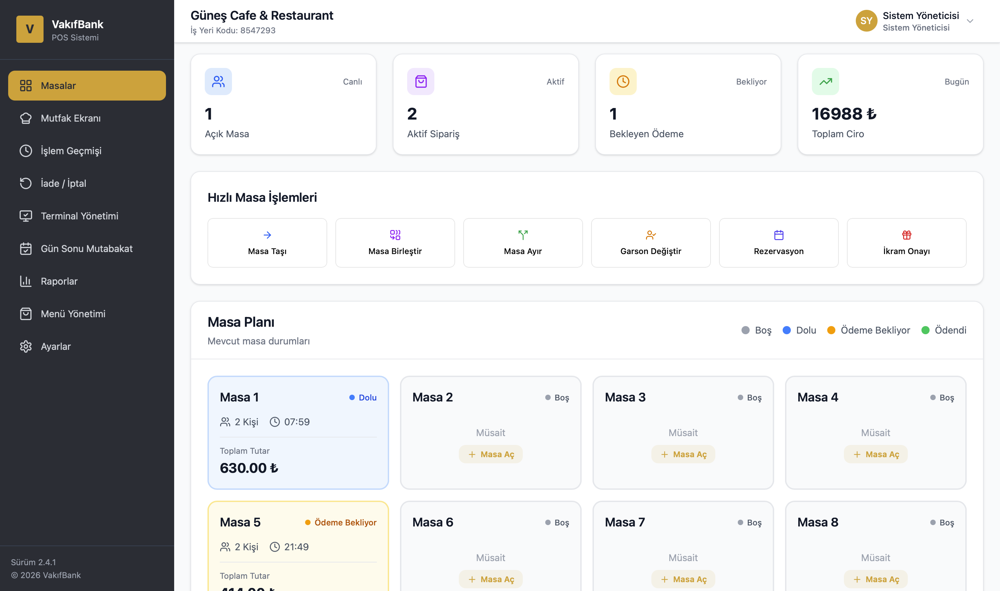
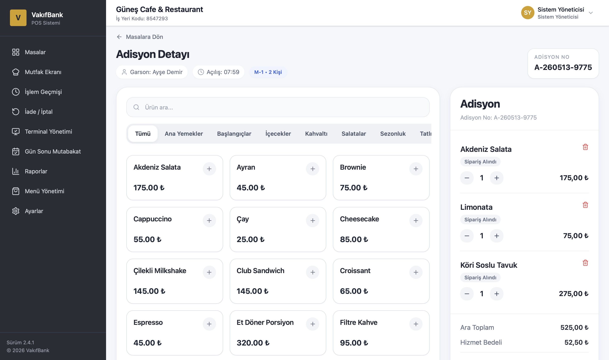
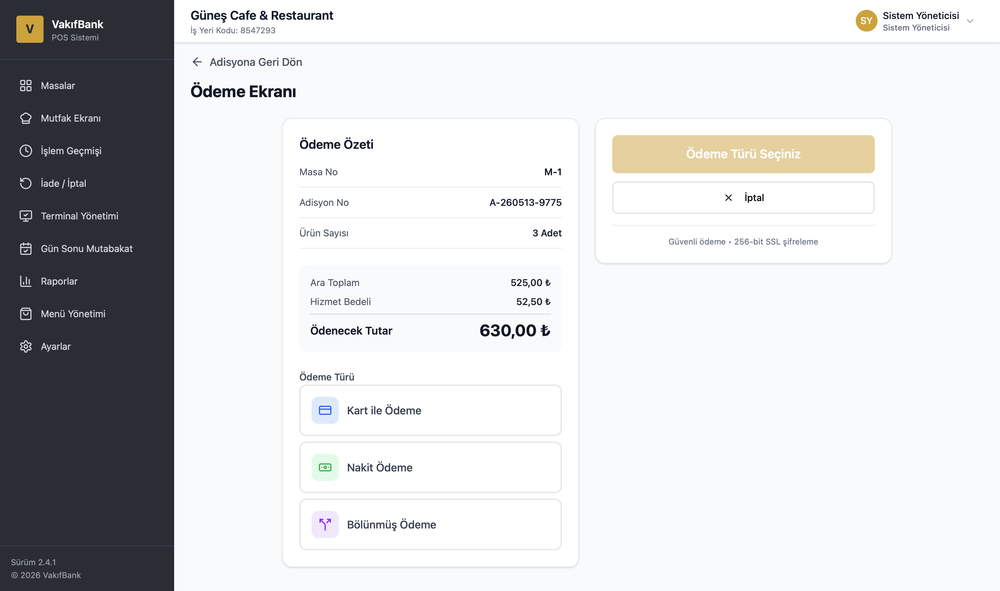
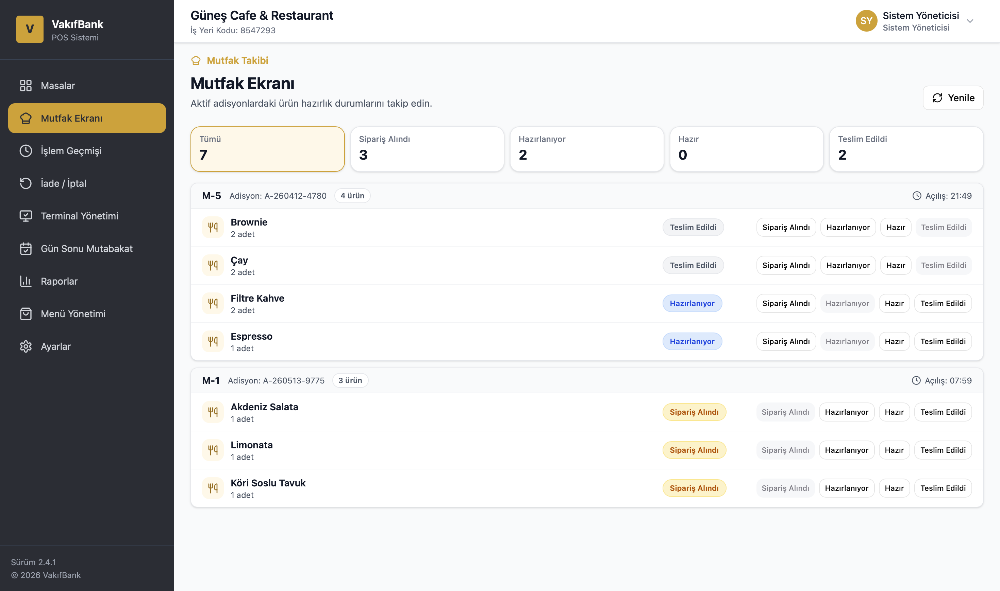
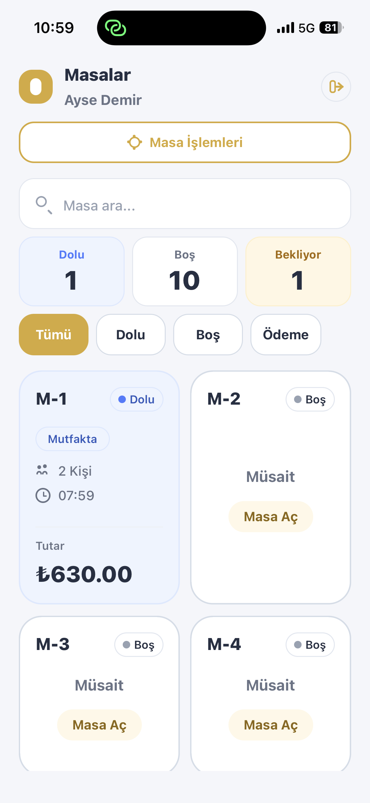
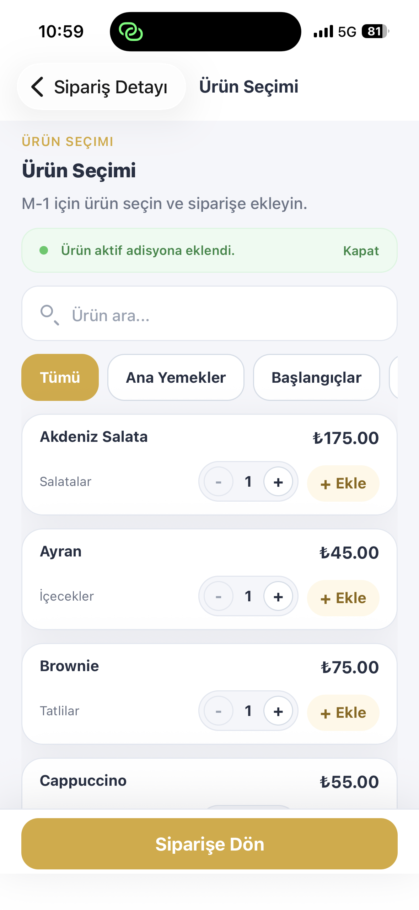
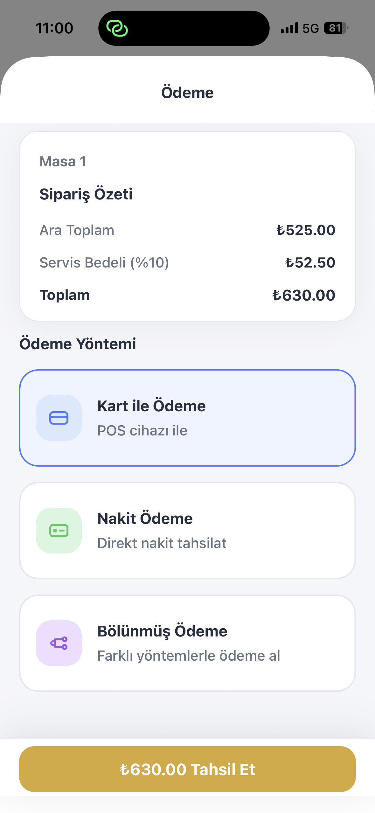
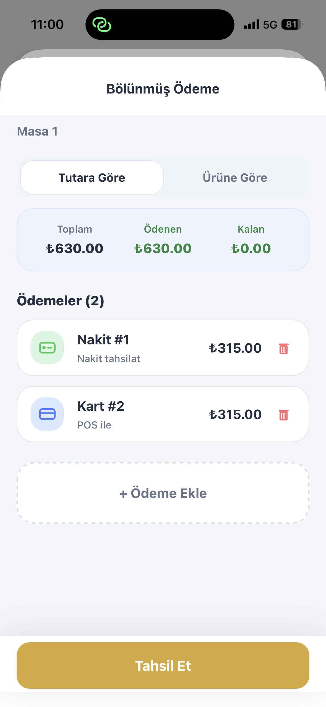

# RestaurantPOS

RestaurantPOS, restoran ve kafe operasyonları için geliştirilen full-stack POS ve adisyon yönetim sistemidir.

Proje; web yönetim paneli, mobil garson uygulaması, ASP.NET Core Web API backend, Supabase PostgreSQL veritabanı, masa/adisyon yönetimi, mutfak ekranı, ödeme akışları, menü yönetimi ve Excel ile toplu menü aktarımı modüllerinden oluşur. Bu proje, VakıfBank Ödeme Sistemleri Uygulama Geliştirme departmanındaki staj sürecinde geliştirilmiş ve restoran/kafe POS senaryolarını modellemek amacıyla hazırlanmıştır.

---

## Türkçe

### Canlı Demo

- Canlı frontend: https://restaurant-pos-pink.vercel.app
- Backend Swagger: Render üzerinde yayınlanan backend adresinin `/swagger` endpointi
- Demo kullanıcıları:

| Rol | Kullanıcı adı | Şifre |
| --- | --- | --- |
| Garson | `ahmet` | `Ahmet123!` |
| Garson | `ayse` | `Ayse123!` |
| Kasiyer | `kasiyer` | `Kasiyer123!` |
| Şube Müdürü | `mudur` | `Mudur123!` |
| Sistem Yöneticisi | `admin` | `Admin123!` |

Render backend ücretsiz/uyuyan servis mantığıyla çalışabileceği için ilk giriş veya ilk API isteği birkaç saniye sürebilir. Kart ödeme, terminal bağlantısı ve bazı POS süreçleri demo/mock akışlarla simüle edilmektedir.

### Proje Özeti

RestaurantPOS; restoran, kafe ve benzeri işletmelerde masa operasyonlarını, adisyon süreçlerini, sipariş hazırlık durumlarını, ödeme kayıtlarını ve menü yönetimini tek bir sistem altında toplamak için geliştirilmiştir.

Proje kapsamı:

- Web POS ve yönetim paneli
- React Native / Expo mobil garson uygulaması
- ASP.NET Core Web API backend
- Supabase PostgreSQL veritabanı
- Supabase üzerinden canlı veri okuma ve realtime senkronizasyon
- Render backend deploy yapısı
- Vercel frontend deploy yapısı

Sistem hem yönetici/kasa tarafındaki web ekranlarını hem de garsonların sahada kullanabileceği mobil uygulama akışlarını destekler. Mobil uygulama yalnızca garson el terminali mantığında değil; Android POS cihazlarına yüklenerek hem sipariş/adisyon yönetimi hem ödeme alma süreçlerinde kullanılabilecek şekilde tasarlanmıştır.

### Öne Çıkan Özellikler

#### Web POS Paneli

- JWT tabanlı giriş, rol bazlı kullanıcı yapısı ve yetki matrisi
- Masa planı; masa açma, taşıma, birleştirme ve ayırma
- Adisyon oluşturma, detay yönetimi ve ürün satırı işlemleri
- Nakit, kart ve bölünmüş ödeme akışları
- Mutfak ekranı ve sipariş hazırlık durumu takibi
- Sipariş durum takibi: Sipariş Alındı, Hazırlanıyor, Hazır, Teslim Edildi
- İşlem geçmişi, iade/iptal ve operasyon kayıtları
- Terminal yönetimi, yazıcı ve entegrasyon ayarları
- Gün sonu mutabakatı ve indirilebilir rapor/çıktılar
- Raporlar, grafikler ve operasyonel özetler
- Menü yönetimi, Excel import ve şablon indirme
- Rezervasyon yönetimi ve ikram onayı

#### Mobil Garson Uygulaması

- Expo / React Native tabanlı garson/POS uygulaması
- Garson girişi ve rol odaklı kullanım
- Masa planı, masa durumu ve masa açma akışları
- Masa işlemleri ve masa/adisyon detay ekranları
- Ürün seçimi, kategori filtreleme ve ürün arama
- Adet seçerek adisyona ürün ekleme
- Nakit, kart/temassız ve bölünmüş ödeme ekranları
- Web mutfak ekranıyla senkron sipariş durumu
- Supabase üzerinden canlı veri okuma ve realtime görünürlük
- Backend API üzerinden gerçek yazma işlemleri

Mobil uygulama; masa, adisyon, ürün seçimi ve ödeme adımlarını sahada kullanılabilecek kompakt bir akış olarak sunar. Supabase üzerinden canlı veri okuma ve realtime senkronizasyon güncel veri görünürlüğü sağlar; masa açma, ürün ekleme, ödeme tamamlama gibi kritik yazma işlemleri backend API üzerinden yapılır.

### Web + Mobil Senkron Yapısı

RestaurantPOS, web ve mobil ekranlar arasında aynı operasyonel veriyi kullanacak şekilde tasarlanmıştır:

1. Garson mobil uygulamada masaya ürün ekler.
2. Ürün web mutfak ekranına düşer.
3. Mutfak personeli sipariş durumunu günceller.
4. Güncellenen durum masa/adisyon ekranlarında görünür.
5. Ödeme sonrası adisyon ve masa durumu backend üzerinden güncellenir.

Bu yapı, restoran operasyonundaki garson, mutfak ve kasa akışlarının aynı veri modeli üzerinde ilerlemesini sağlar.

### Teknoloji Yığını

#### Backend

- ASP.NET Core Web API
- .NET 8
- Entity Framework Core
- PostgreSQL / Supabase
- JWT Authentication
- FluentValidation
- ClosedXML ile Excel import
- Swagger / OpenAPI

#### Frontend

- React
- TypeScript
- Vite
- Tailwind CSS
- shadcn/ui tarzından ilham alan özel component yapısı
- React Router
- Sonner toast bildirimleri
- Lucide React ikonları

#### Mobile

- React Native
- Expo
- TypeScript
- Zustand
- React Navigation
- Supabase client

#### Deployment

- Vercel frontend deploy
- Render backend deploy
- Supabase PostgreSQL, canlı veri okuma ve realtime senkronizasyon altyapısı

### Mimari

RestaurantPOS modüler bir full-stack yapı üzerine kuruludur:

- `backend/` REST API, authentication, authorization, iş kuralları, EF Core repository/service katmanı ve veritabanı migration süreçlerini içerir.
- `src/` React tabanlı web POS panelini ve yönetim ekranlarını içerir.
- `mobileapp/` Expo tabanlı mobil garson/POS uygulamasını içerir.
- Supabase PostgreSQL ana operasyonel veritabanıdır.
- Supabase üzerinden canlı veri okuma ve realtime senkronizasyon mobil uygulamada güncel veri görünürlüğü için kullanılır.
- Kritik yazma işlemleri backend API üzerinden yapılır; böylece iş kuralları, audit logging ve yetki kontrolleri merkezi kalır.

Örnek operasyon akışı:

```text
Web / Mobile UI
      |
      v
ASP.NET Core Web API
      |
      v
EF Core Service + Repository Layer
      |
      v
Supabase PostgreSQL
```

### Veritabanı ve Süreç Yapısı

#### 1. İş Yeri ve Kullanıcı Yönetimi

`Branches`, `Users`, `Roles`, `Permissions`, `RolePermissions`, `AppSettings`

Şube, kullanıcı, rol, yetki ve uygulama ayarı yönetimini kapsar.

#### 2. Masa ve Adisyon Yönetimi

`RestaurantTables`, `Bills`, `BillItems`, `TableReservations`

Masa durumu, aktif adisyon, adisyon satırları ve rezervasyon süreçlerini yönetir.

#### 3. Ürün ve Menü Yönetimi

`ProductCategories`, `Products`

Ürün, kategori, menü görünürlüğü ve Excel import süreçlerinin temelini oluşturur.

#### 4. Ödeme ve POS Terminal Süreçleri

`Payments`, `PosTerminals`, `Shifts`, `PrinterSettings`

Ödeme kayıtları, terminal bilgileri, vardiya süreçleri ve yazıcı ayarlarını kapsar.

#### 5. Denetim ve Operasyon Kayıtları

`AuditLogs`

Kritik operasyon kayıtları için kullanılır.

#### Temel İlişkiler

- `Branches`, kullanıcı, masa, terminal, ayar ve shift kayıtlarıyla ilişkilidir.
- `RestaurantTables`, aktif adisyonu `CurrentBillId` ile `Bills` tablosuna bağlar.
- `Bills`, masa, şube, garson ve ödeme toplamlarını; `BillItems` ürün snapshot bilgilerini tutar.
- `Products`, `ProductCategories`; `Payments` ise `Bills`, `Users` ve `PosTerminals` ile ilişkilidir.
- `RolePermissions`, `AuditLogs` ve `TableReservations` yetki, denetim ve rezervasyon süreçlerini destekler.

### Ekran Görüntüleri

Aşağıdaki ekran görüntüleri, web paneli ve mobil garson uygulamasının temel bölümlerini göstermektedir.

#### Web Ekranları

| Dashboard / Masa Planı | Adisyon Detayı |
| --- | --- |
|  |  |
| Ödeme Ekranı | Mutfak Ekranı |
|  |  |

Diğer web ekranları:

- Bölünmüş Ödeme: `docs/screenshots/web-split-payment.png`
- İşlem Geçmişi: `docs/screenshots/web-history.png`
- İade / İptal: `docs/screenshots/web-refund.png`
- Terminal Yönetimi: `docs/screenshots/web-terminal-management.png`
- Gün Sonu Mutabakat: `docs/screenshots/web-end-of-day.png`
- Raporlar: `docs/screenshots/web-reports.png`
- Menü Yönetimi: `docs/screenshots/web-menu-management.png`
- Rol ve Yetki Matrisi: `docs/screenshots/web-role-permissions.png`

#### Mobil Ekranlar

| Mobil Masa Planı | Mobil Ürün Seçimi |
| --- | --- |
|  |  |
| Mobil Ödeme | Mobil Bölünmüş Ödeme |
|  |  |

Diğer mobil ekranlar:

- Mobil Masa Detayı: `docs/screenshots/mobile-table-detail.png`
- Mobil Masa İşlemleri: `docs/screenshots/mobile-table-actions.png`
- Mobil Temassız Ödeme Bekleme: `docs/screenshots/mobile-contactless-payment.png`

### Proje Yapısı

```text
RestaurantPOS/
├── backend/             # ASP.NET Core Web API
├── src/                 # React + Vite web frontend
├── mobileapp/           # Expo / React Native mobile app
├── docs/screenshots/    # GitHub README screenshot assets
├── README.md
├── package.json
└── RestaurantPOS.sln
```

### Kurulum

#### 1. Repoyu Klonlama

```bash
git clone <repository-url>
cd RestaurantPOS
```

#### 2. Backend Çalıştırma

```bash
dotnet restore backend/Backend.csproj
dotnet ef database update --project backend/Backend.csproj
dotnet run --project backend/Backend.csproj
```

Backend varsayılan olarak ASP.NET Core ayarlarına göre çalışır. Swagger adresi ortam konfigürasyonuna göre değişebilir.

Backend Swagger: `<backend-base-url>/swagger`

#### 3. Web Frontend Çalıştırma

```bash
npm install
npm run dev
```

Frontend Vite üzerinden çalışır. API adresi `VITE_API_BASE_URL` ile verilir.

#### 4. Mobil Uygulamayı Çalıştırma

```bash
cd mobileapp
npm install
npm run start
# veya cache temizleyerek:
npm run start:clear
# alternatif:
npx expo start -c
```

Expo açıldıktan sonra iOS simulator, Android emulator veya Expo Go ile QR kod okutularak fiziksel cihaz üzerinden test edilebilir.

#### 5. Örnek Env Değişkenleri

Gerçek secret, connection string, token veya şifre README içinde tutulmamalıdır. Aşağıdaki değerler sadece değişken adlarını göstermek için verilmiştir.

Backend:

```env
ConnectionStrings__DefaultConnection=
Jwt__Key=
```

Web frontend:

```env
VITE_API_BASE_URL=
```

Mobile:

```env
EXPO_PUBLIC_SUPABASE_URL=
EXPO_PUBLIC_SUPABASE_PUBLISHABLE_KEY=
EXPO_PUBLIC_BACKEND_BASE_URL=
```

### Güvenlik ve Production Notu

Bu proje portfolyo/staj projesi niteliğindedir. Finalize edilmiş production ürünü değildir. README içinde yer alan demo kullanıcıları production hesabı değildir; yalnızca teknik inceleme ve portfolyo gösterimi için hazırlanmıştır. Ödeme alma ekranları ve terminal yönetimi gerçek banka/POS entegrasyonu içermeyen demo akışlardır; nakit ödeme ve temel backend ödeme kayıt süreçleri çalışmaktadır. RLS/policy, gerçek POS entegrasyonu, test kapsamı, monitoring, rate limiting ve operasyonel güvenlik daha da geliştirilebilir.

---

## English

### Live Demo

- Live frontend: https://restaurant-pos-pink.vercel.app
- Backend Swagger: available through the `/swagger` endpoint of the deployed Render backend URL
- Demo accounts:

| Role | Username | Password |
| --- | --- | --- |
| Waiter | `ahmet` | `Ahmet123!` |
| Waiter | `ayse` | `Ayse123!` |
| Cashier | `kasiyer` | `Kasiyer123!` |
| Branch Manager | `mudur` | `Mudur123!` |
| System Administrator | `admin` | `Admin123!` |

Because the Render backend may run as a free/sleeping service, the first login or first API request can take a few seconds. Card payment, terminal connection and some POS flows are simulated through demo/mock flows.

### Project Overview

RestaurantPOS is a full-stack POS and bill management system built for restaurant and cafe operations. It includes a web management panel, a mobile waiter application, an ASP.NET Core Web API backend, Supabase PostgreSQL, table/bill management, kitchen tracking, payment flows, menu management, and Excel-based bulk menu import.

This project was developed during an internship in the VakıfBank Payment Systems Application Development department. It was prepared to model restaurant/cafe POS processes, bill management, payment flows, and mobile waiter/POS usage scenarios.

Project scope:

- Web POS dashboard
- React Native / Expo mobile waiter application
- ASP.NET Core Web API backend
- Supabase PostgreSQL database
- Supabase live reads and realtime synchronization
- Render backend deployment
- Vercel frontend deployment

The system is designed to support both web-based management/cashier workflows and mobile workflows used by waiters on the floor. The mobile app is not limited to handheld waiter terminals; it is also designed to run on Android POS devices for both order/bill management and payment collection flows.

### Key Features

#### Web POS Panel

- JWT-based authentication, role-based users and permission matrix
- Table plan with open, move, merge and split operations
- Bill creation, bill detail management and item operations
- Cash, card and split payment flows
- Kitchen screen and order preparation tracking
- Order status tracking: Order Received, Preparing, Ready, Delivered
- Transaction history, refunds/cancellations and operational records
- Terminal management, printer and integration settings
- End-of-day reconciliation with downloadable/exportable records
- Reports, charts and operational summaries
- Menu management, Excel import and template download
- Reservations and complimentary item approval

#### Mobile Waiter Application

- Expo / React Native waiter/POS application
- Waiter login and role-focused usage
- Table plan, table status and open-table flows
- Table actions and table/bill detail screens
- Product selection, category filtering and product search
- Add products to bills with selected quantities
- Cash, card/contactless and split payment screens
- Order status synchronized with the web kitchen screen
- Live data reads and realtime visibility through Supabase
- Real write operations through the backend API

The mobile app provides a compact operational flow for table, bill, product selection and payment steps. Supabase live reads and realtime synchronization provide up-to-date data visibility, while critical write operations such as opening tables, adding items and completing payments go through the backend API.

### Web + Mobile Synchronization

RestaurantPOS is designed around a shared operational data model:

1. A waiter adds products from the mobile app.
2. The item appears on the web kitchen screen.
3. Kitchen staff updates the preparation status.
4. Updated statuses are visible on table and bill screens.
5. After payment, the bill and table status are updated through the backend.

This flow keeps waiter, kitchen and cashier operations aligned on the same backend data.

### Technology Stack

#### Backend

- ASP.NET Core Web API
- .NET 8
- Entity Framework Core
- PostgreSQL / Supabase
- JWT Authentication
- FluentValidation
- ClosedXML for Excel import
- Swagger / OpenAPI

#### Frontend

- React
- TypeScript
- Vite
- Tailwind CSS
- custom component structure inspired by shadcn/ui style
- React Router
- Sonner toast notifications
- Lucide React icons

#### Mobile

- React Native
- Expo
- TypeScript
- Zustand
- React Navigation
- Supabase client

#### Deployment

- Vercel for the frontend
- Render for the backend
- Supabase for PostgreSQL, live reads and realtime synchronization

### Architecture

RestaurantPOS follows a modular full-stack architecture:

- `backend/` contains the REST API, authentication, authorization, business rules, EF Core repository/service layer and database migrations.
- `src/` contains the React-based web POS panel and management screens.
- `mobileapp/` contains the Expo-based mobile waiter/POS application.
- Supabase PostgreSQL is the primary operational database.
- Supabase live reads and realtime synchronization are used by the mobile app for up-to-date data visibility.
- Critical write operations go through the backend API so business rules, audit logging and authorization remain centralized.

High-level request flow:

```text
Web / Mobile UI
      |
      v
ASP.NET Core Web API
      |
      v
EF Core Service + Repository Layer
      |
      v
Supabase PostgreSQL
```

### Database and Process Structure

The full SQL script is intentionally not embedded in this README. The schema is managed through EF Core migrations and the Supabase PostgreSQL database.

#### 1. Business and User Management

`Branches`, `Users`, `Roles`, `Permissions`, `RolePermissions`, `AppSettings`

Branch, user, role, permission and application setting management.

#### 2. Table and Bill Management

`RestaurantTables`, `Bills`, `BillItems`, `TableReservations`

Table status, active bills, bill line items and reservations.

#### 3. Product and Menu Management

`ProductCategories`, `Products`

Product records, categories, menu availability and Excel import flows.

#### 4. Payment and POS Terminal Processes

`Payments`, `PosTerminals`, `Shifts`, `PrinterSettings`

Payment records, terminal information, shift operations and printer settings.

#### 5. Audit and Operational Records

`AuditLogs`, `__EFMigrationsHistory`

Critical operation logs and EF Core migration history.

#### Core Relationships

- `Branches` relates to users, tables, terminals, settings and shifts.
- `RestaurantTables` links the active bill through `CurrentBillId` to `Bills`.
- `Bills` stores table, branch, waiter and payment totals; `BillItems` stores product snapshots.
- `Products` belongs to `ProductCategories`; `Payments` relates to `Bills`, `Users` and `PosTerminals`.
- `RolePermissions`, `AuditLogs` and `TableReservations` support permission, audit and reservation flows.

### Screenshots

The following screenshots show the main parts of the web panel and mobile waiter application.

#### Web Screenshots

| Dashboard / Table Plan | Bill Detail |
| --- | --- |
|  |  |
| Payment Screen | Kitchen Screen |
|  |  |

Other web screens:

- Split Payment: `docs/screenshots/web-split-payment.png`
- Transaction History: `docs/screenshots/web-history.png`
- Refund / Cancel: `docs/screenshots/web-refund.png`
- Terminal Management: `docs/screenshots/web-terminal-management.png`
- End-of-Day Reconciliation: `docs/screenshots/web-end-of-day.png`
- Reports: `docs/screenshots/web-reports.png`
- Menu Management: `docs/screenshots/web-menu-management.png`
- Role and Permission Matrix: `docs/screenshots/web-role-permissions.png`

#### Mobile Screenshots

| Mobile Table Plan | Mobile Product Selection |
| --- | --- |
|  |  |
| Mobile Payment | Mobile Split Payment |
|  |  |

Other mobile screens:

- Mobile Table Detail: `docs/screenshots/mobile-table-detail.png`
- Mobile Table Actions: `docs/screenshots/mobile-table-actions.png`
- Mobile Contactless Payment Waiting: `docs/screenshots/mobile-contactless-payment.png`

### Project Structure

```text
RestaurantPOS/
├── backend/             # ASP.NET Core Web API
├── src/                 # React + Vite web frontend
├── mobileapp/           # Expo / React Native mobile app
├── docs/screenshots/    # GitHub README screenshot assets
├── README.md
├── package.json
└── RestaurantPOS.sln
```

### Installation

#### 1. Clone the Repository

```bash
git clone <repository-url>
cd RestaurantPOS
```

#### 2. Run the Backend

```bash
dotnet restore backend/Backend.csproj
dotnet ef database update --project backend/Backend.csproj
dotnet run --project backend/Backend.csproj
```

Backend Swagger: `<backend-base-url>/swagger`

#### 3. Run the Web Frontend

```bash
npm install
npm run dev
```

The web frontend uses `VITE_API_BASE_URL` for the backend API URL.

#### 4. Run the Mobile App

```bash
cd mobileapp
npm install
npm run start
# or start with a cleared Expo cache:
npm run start:clear
# alternative:
npx expo start -c
```

After Expo starts, the app can be tested on an iOS simulator, Android emulator, or a physical device by scanning the QR code with Expo Go.

#### 5. Example Environment Variables

Do not store real secrets, connection strings, tokens or passwords in this README. The values below show only the expected variable names.

Backend:

```env
ConnectionStrings__DefaultConnection=
Jwt__Key=
```

Web frontend:

```env
VITE_API_BASE_URL=
```

Mobile:

```env
EXPO_PUBLIC_SUPABASE_URL=
EXPO_PUBLIC_SUPABASE_PUBLISHABLE_KEY=
EXPO_PUBLIC_BACKEND_BASE_URL=
```

### Security and Production Note

This project is a portfolio/internship project. It is not a finalized production product. The demo users listed in this README are not production accounts; they are prepared only for technical review and portfolio demonstration. Payment collection screens and terminal management are demo flows without a real bank/POS integration; cash payment and core backend payment record flows are functional. RLS/policies, real POS integration, test coverage, monitoring, rate limiting and operational security can be improved further before production use.
